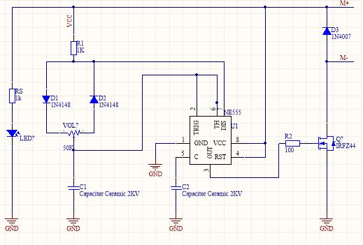

# 🚀 PWM Controller using NE555 & IRFZ44  

> **A simple yet powerful PWM controller for DC motors and LEDs!**  

## 🎯 Overview  
This project is a **Pulse Width Modulation (PWM) controller** using the **NE555 timer** and **IRFZ44 MOSFET**. The circuit allows smooth speed control for **DC motors** and **brightness adjustment for LEDs**.  

🔹 **Adjustable PWM Signal** - Control via a potentiometer.  
🔹 **Efficient Switching** - IRFZ44 MOSFET for high power handling.  
🔹 **Protection Circuitry** - Diodes prevent voltage spikes.  
🔹 **Stable Performance** - High-voltage ceramic capacitors included.  

## 📜 Schematic  
🖼️ **Circuit Diagram:**  
    

## 🛠️ Components List  
| Component      | Value/Type       | Description                    |
|---------------|-----------------|--------------------------------|
| **IC**        | NE555            | Timer for PWM generation      |
| **MOSFET**    | IRFZ44           | High-power switching          |
| **Diodes**    | 1N4148, 1N4007   | Protection components         |
| **Capacitors**| 2KV Ceramic      | Stabilization                 |
| **Resistors** | 1KΩ, 100Ω        | Current limiting              |
| **Potentiometer** | 50KΩ        | Adjusts PWM duty cycle       |
| **LED**       | Indicator LED    | PWM signal visualization      |

## ⚙️ How It Works  
1️⃣ The **NE555 timer** generates a **PWM signal**.  
2️⃣ The **potentiometer** adjusts the **duty cycle**.  
3️⃣ The **IRFZ44 MOSFET** switches the load based on the PWM signal.  
4️⃣ **Diodes** protect against voltage spikes and back EMF.  

## 🎛️ Usage  
🔌 **Assemble the circuit** following the schematic.  
🎚️ **Turn the potentiometer** to adjust the output.  
📟 **Monitor PWM output** using an oscilloscope, LED, or motor.  

## 🔥 Applications  
✔️ **DC motor speed control**  
✔️ **LED dimming**  
✔️ **Power regulation circuits**  
✔️ **DIY electronics projects**  

## 📜 License  
🆓 This project is **open-source** under the **MIT License**.  
Feel free to modify, improve, and contribute!  

---

💡 **Contributions are welcome!** Create a pull request or open an issue for any suggestions.  
🌟 If you like this project, don't forget to **⭐ star this repository!**  
